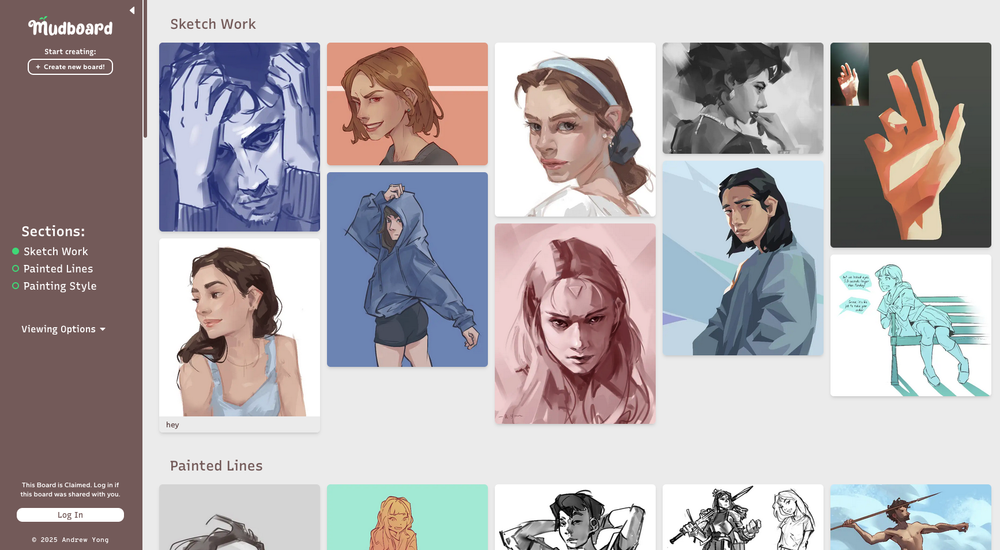

Hi. This is Mudboard's repo! The drag and drop reference organizer for artists.

### Directions

The main entry point is /app/b/\[boardId\]/board.tsx

This is where you'll see how each board is created. A board is initialized using /hooks/use-init-board.tsx

The file that handles all the drag/drop logic is
/hooks/gallery/use-drag-handlers.tsx

/hooks/use-import-images.tsx is also of note. It's what happens when you drop in an image from outside the app.

Lastly, /lib/db-actions is the folder with all the files we sync and make changes to the database

### Setup

1. you need our .env files to access the database
2. npm i && npm run dev

note: there is a secret repo where we host the proxy, but that's not required for setup
